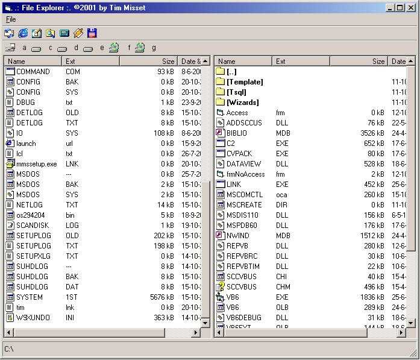



## File Explorer \(like the windows version\)

### Description

Using this project you can load 2 listviews for browsing through folders, icons are added, you can make shortcuts, see properties, also change the width of the listviews while the program is running. Also filter file extensions from loading, and drag/drop copying.
 
### More Info
 

             |
---                |---
**Submitted On**   |2001-10-21 11:26:52
**By**             |[Tim Misset](https://github.com/Planet-Source-Code/PSCIndex/blob/master/ByAuthor/tim-misset.md)
**Level**          |Intermediate
**User Rating**    |4.6 (23 globes from 5 users)
**Compatibility**  |VB 5\.0, VB 6\.0
**Category**       |[Windows API Call/ Explanation](https://github.com/Planet-Source-Code/PSCIndex/blob/master/ByCategory/windows-api-call-explanation__1-39.md)
**World**          |[Visual Basic](https://github.com/Planet-Source-Code/PSCIndex/blob/master/ByWorld/visual-basic.md)
**Archive File**   |[File Explo3017810212001\.zip](https://github.com/Planet-Source-Code/tim-misset-file-explorer-like-the-windows-version__1-28268/archive/master.zip)

